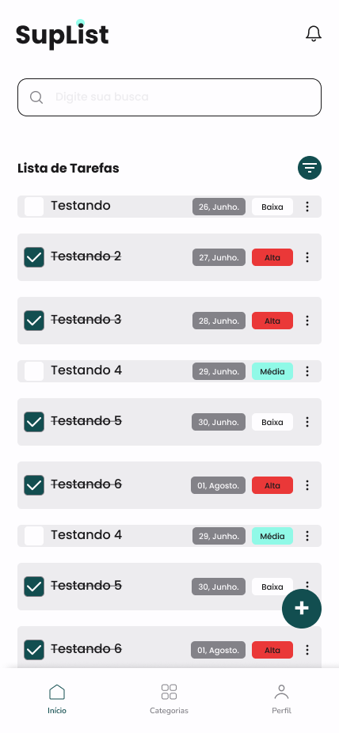
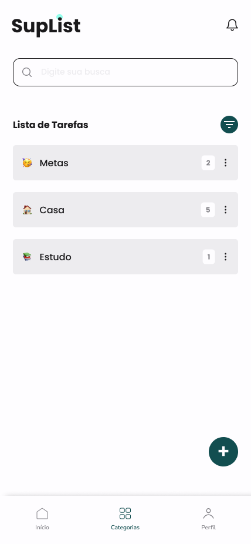

# 📝 SupList - Todo List App

Um aplicativo de lista de tarefas desenvolvido em React Native como projeto de estudos para demonstrar conhecimentos em desenvolvimento mobile moderno.

## 📱 Screenshots

<div align="center">
  
  
  
  
</div>

<div align="center">
  
  
  
</div>

## 🚀 Tecnologias Utilizadas

- **React Native 0.74.3** - Framework para desenvolvimento mobile
- **TypeScript** - Linguagem de programação com tipagem estática
- **React Navigation** - Navegação entre telas
  - Bottom Tabs Navigator
  - Native Stack Navigator
- **Shopify Restyle** - Sistema de design e estilização
- **React Native SVG** - Ícones e componentes gráficos
- **React Native Safe Area Context** - Área segura para dispositivos

## 🏗️ Arquitetura do Projeto

O projeto segue uma arquitetura bem organizada com separação de responsabilidades:

```
src/
├── assets/
│   ├── icons/          # Ícones SVG customizados
│   └── svgs/           # Logos e gráficos SVG
├── brand/              # Elementos de marca
├── components/         # Componentes reutilizáveis
│   ├── ActivityIndicator/
│   ├── Box/            # Sistema de layout
│   ├── Button/         # Botões estilizados
│   ├── FabButton/      # Floating Action Button
│   ├── Icon/           # Sistema de ícones
│   ├── PasswordInput/  # Input de senha
│   ├── Screen/         # Wrapper de tela
│   ├── Text/           # Componente de texto
│   └── TextInput/      # Input de texto
├── hooks/              # Hooks customizados
├── routes/             # Configuração de navegação
├── screens/            # Telas da aplicação
│   ├── app/           # Telas do app autenticado
│   └── auth/          # Telas de autenticação
└── theme/              # Sistema de design
```

## 🎨 Sistema de Design

O projeto implementa um sistema de design robusto utilizando **Shopify Restyle**:

### Cores

```typescript
const palette = {
  greenPrimary: '#18444B', // Verde principal
  greenPrimaryLight: '#68FEE4', // Verde claro
  redError: '#EA3838', // Vermelho de erro
  redErrorLight: '#FEEFEE', // Vermelho claro
  grayBlack: '#1A191B', // Preto acinzentado
  gray1: '#EDECEF', // Cinza claro
  gray2: '#E1E1E1', // Cinza médio
  grayWhite: '#FEFDFF', // Branco
};
```

### Espaçamentos

```typescript
spacing: {
  s8: 8,
  s14: 14,
  s16: 16,
  s20: 20,
  s26: 26,
  s40: 40,
  s60: 60,
}
```

### Variantes de Texto

- `header` - Cabeçalhos principais
- `smallHeader` - Cabeçalhos secundários
- `textMedium` - Texto médio
- `button` - Texto de botões

## 🧩 Componentes Principais

### Sistema de Ícones

O app possui um sistema de ícones SVG customizados com suporte a:

- Tamanhos dinâmicos
- Cores do tema
- Estados (normal/ativo)
- Ações de toque

### Componentes de Layout

- **Box**: Sistema flexível de layout baseado no Restyle
- **Screen**: Wrapper de tela com SafeArea e navegação
- **TouchableOpacityBox**: Box com suporte a toque

### Componentes de Input

- **TextInput**: Input de texto estilizado
- **PasswordInput**: Input de senha com toggle de visibilidade
- **Button**: Botões com presets (primary, outline)
- **FabButton**: Floating Action Button

## 🔧 Como Executar

### Pré-requisitos

- Node.js >= 18
- React Native CLI
- Xcode (iOS)
- Android Studio (Android)
- CocoaPods (iOS)

### Instalação

```bash
# Clone o repositório
git clone https://github.com/alwspiderc/SupList.git

# Entre na pasta do projeto
cd SupList

# Instale as dependências
npm install

# iOS - Instale as dependências nativas
cd ios && pod install && cd ..
```

```bash
# iOS
npm run ios

# Android
npm run android

# Metro Bundler
npm start
```

## 📋 Funcionalidades Implementadas

- ✅ Splash Screen
- ✅ Tela de Boas-vindas
- ✅ Sistema de Autenticação (UI)
- ✅ Login e Cadastro
- ✅ Recuperação de Senha
- ✅ Confirmação de Email
- ✅ Navegação por Tabs
- ✅ Tela Principal (Home)
- ✅ Sistema de Categorias
- ✅ Design System Completo
- ✅ Componentes Reutilizáveis
- ✅ Tema Customizado

## 🎯 Conceitos Demonstrados

Este projeto foi desenvolvido para demonstrar conhecimentos em:

- **Arquitetura**: Organização de código escalável
- **TypeScript**: Tipagem forte e interfaces
- **Design System**: Sistema de design consistente
- **Navegação**: React Navigation com múltiplos tipos
- **Componentes**: Criação de componentes reutilizáveis
- **Hooks**: Hooks customizados para lógica compartilhada
- **SVG**: Implementação de ícones escaláveis
- **Tema**: Sistema de temas com Shopify Restyle
- **Responsividade**: SafeArea e adaptação a diferentes telas

## 🛠️ Scripts Disponíveis

```json
{
  "android": "react-native run-android",
  "ios": "react-native run-ios",
  "lint": "eslint .",
  "start": "react-native start",
  "test": "jest"
}
```

## 📦 Principais Dependências

- **@react-navigation** - Navegação
- **@shopify/restyle** - Sistema de design
- **react-native-svg** - Componentes SVG
- **react-native-safe-area-context** - Área segura
- **react-native-screens** - Otimização de telas

## 👨‍💻 Desenvolvedor

Desenvolvido por **Ester** como projeto de estudos em React Native.

---

_Este projeto faz parte do meu portfólio e demonstra habilidades em desenvolvimento mobile com React Native, TypeScript e boas práticas de arquitetura._
